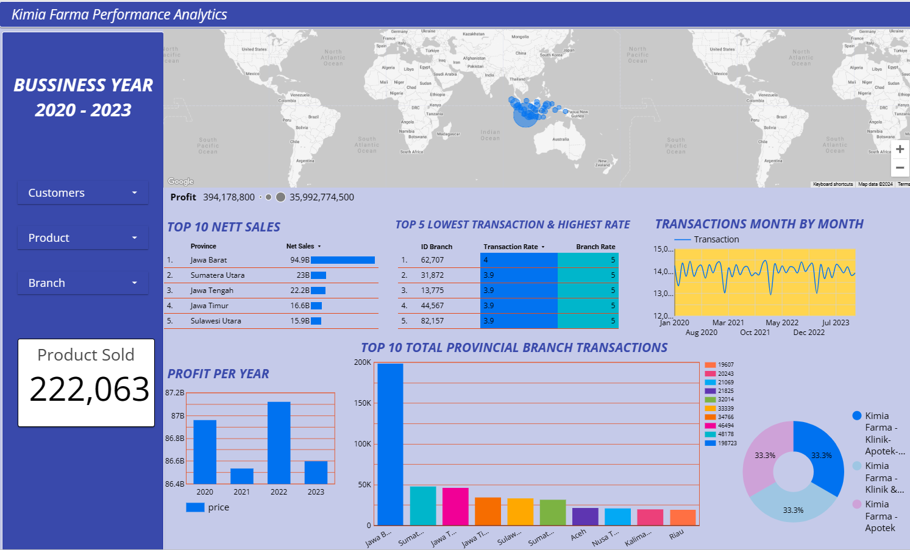

# Final Project : Dashboard Performance Analytics Kimia Farma Business Year 2020-2023

## Tools

- Looker Studio
- Big Query

## Challenge

Pada proyek ini, saya membuat sebuah dashboard analisis kinerja Kimia Farma pada tahun 2020-2023 di Google Looker Studio. Dashboard ini saya buat berdasarkan tabel analisa yang telah saya buat sebelumnya pada pada BigQuery, dengan menghubungkan table tersebut ke Google Looker Studio. Saya Mendesain dashboard tersebut sesuai dengan kreativitas saya, dengan mencakup:

- Judul Dashboard
- Filter Control
- Snapshot Data
- Perbandingan Pendapatan Kimia Farma dari Tahun ke Tahun
- Top 10 Total Transaksi Cabang Provinsi
- Top 10 Nett Sales Cabang Provinsi
- Top 5 Cabang dengan Rating Tertinggi, namun Rating Transaksi Terendah
- Indonesia's Geo Map Untuk Total Profit Masing-Masing Provinsi

## Data Visualization

<a href="https://lookerstudio.google.com/reporting/d76a55de-3d0e-4da2-84c1-d097b2cb429c">Lihat di Halaman Looker Studio</a>

Gambar 1. Dashboard Performance Analytics Kimia Farma

